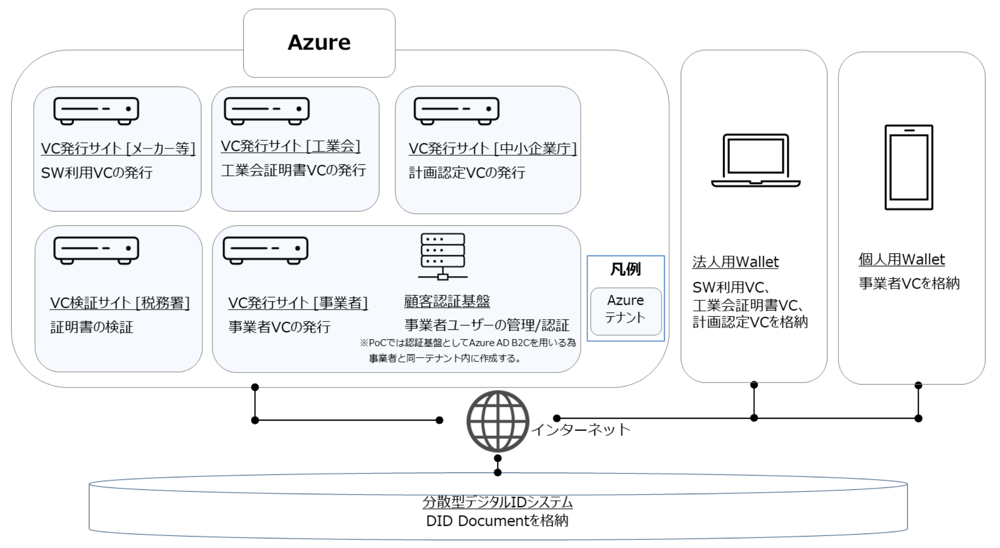
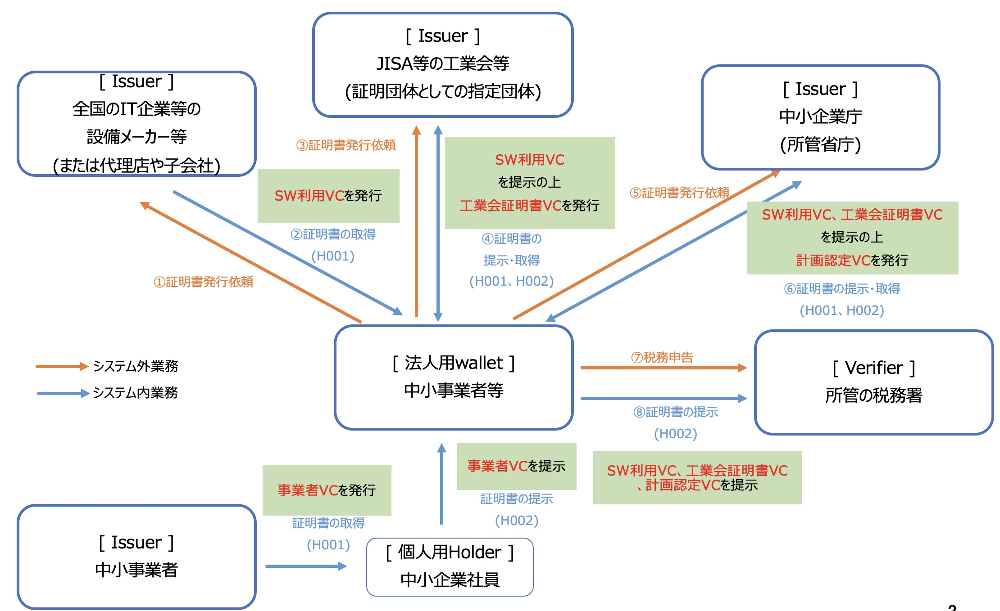

# 工業会証明書デジタル化コンソーシアム
## プロジェクト概要

## フォルダ構成

-   01 【09_JISA】最終成果報告書\_20230323.docx
-   01 【09_JISA】別添 1 本システムで検証を行うデータ及びデータのやり取りの内容.xlsx
-   01 【09_JISA】別添 2 合意の履行のトレースの内容.xlsx
-   01 【09_JISA】別添 3 TrusterdWeb 実証結果シート.xlsx
-   01 【09_JISA】別添 4 申し送り課題一覧表.xlsx
-   02 【09_JISA】最終成果報告書概要版\_20230324.pptx
-   03 【09_JISA】成果概要\_20230324.pptx
-   04 【09_JISA】アプリケーション開発に係る成果物
    -   01 要件定義書\*20220324.pptx
    -   02 基本設計書\*20220324.pptx
    -   03 ソフトウェアソースコード及びスクリプト類
    -   04 ソフトウェアの使用前説明書・操作手順書（README）等
-   05 【09_JISA】デモ動画

## 動作環境
本実証実験で開発したシステム全体構成を以下に示す。
なお、VC発行サイト毎に秘密鍵およびDIDドキュメントを生成するため、Microsoft Azureのテナントをサイト毎に分けてアプリケーションを構築している。

<table>
  <caption>主要な製品・ライブラリ一覧</caption>
  <thead>
    <tr>
      <th>コンポーネント名称</th> <th>フレームワーク</th>　 <th>実行環境</th>
    </tr>
  </thead>
  <tr>
    <td> 法人用wallet </td> <td>Node.js(Next.js, Express.js)</td><td> Node 16 LTS </td>
  </tr>
    <tr>
    <td> 個人用wallet </td> <td>Node.js(Next.js)</td><td> Node 16 LTS </td>
  </tr>
    <tr>
    <td> 証明書発行サイト </td> <td>Node.js(Express.js)</td><td> Node 16 LTS </td>
  </tr>
    <tr>
    <td> 証明書検証サイト </td> <td>Node.js(Express.js)</td><td> Node 16 LTS </td>
  </tr>
</table>

認証基盤
・Azure AD（サービス名：Azure Active Directory B2C）
​
## 各リポジトリの役割・機能

【個人用wallet】

法人用walletを使うためのログインに必要なwalletです。事業者VCを格納し、法人に提示することで法人walletにログインすることができます。

【法人用wallet】

各団体から発行される工業会証明書などの証明書を保存し、税務申告ができます。

【全国の IT 企業等の設備メーカー等 Issuer】

** 

【代表団体等の工業会等（証明団体） Issuer】

【所管官庁（中小企業庁） Issuer】

【所轄の税務署 Verifier】

## 実行環境について
動作環境を準備の上、任意の場所にソースコードを展開し、以下のページの手順に従って準備を行います。また、個人用walletについては、OSSである[Custom Identity Wallet](https://github.com/did-developer-community/custom-identity-wallet)を使用するため、実行環境の作成は必要ありません。

[法人用wallet](https://github.com/09-JISA/corp-wallet#%E5%88%9D%E6%9C%9F%E8%A8%AD%E5%AE%9A%E3%81%A8%E5%AE%9F%E8%A1%8C%E6%96%B9%E6%B3%95)

[全国の IT 企業等の設備メーカー等 Issuer](https://github.com/09-JISA/issuer-web-maker#setup)

[代表団体等の工業会等（証明団体） Issuer](https://github.com/09-JISA/issuer-web-jisa#setup)

[所管官庁（中小企業庁） Issuer](https://github.com/09-JISA/issuer-web-agency#setup)

[所轄の税務署 Verifier](https://github.com/09-JISA/verifier-web-taxoffice#setup)

【注意事項】

本アプリケーションは実証実験用のプロトタイプシステムです。
実運用上での利用は保障されていません。
実運用においては、性能およびセキュリティ等についても別途検討が必要です。
​
​